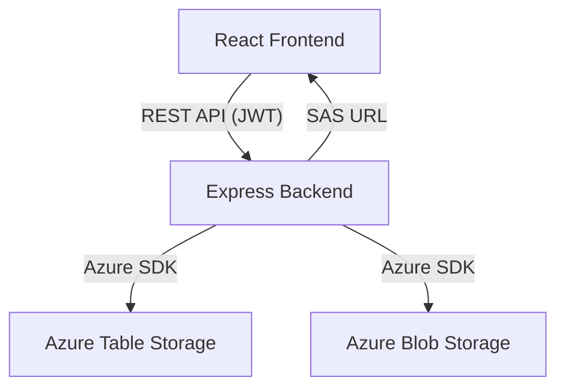

# Customer Portal Architecture

## Overview
The Customer Portal is a full-stack web application designed for secure document management and user administration. It is built with a Node.js/Express backend, a React frontend, and uses Azure Table and Blob Storage for persistence.

---

## High-Level Architecture

```
+-------------------+         HTTPS         +-------------------+         HTTPS         +-------------------+
|   React Frontend  | <-------------------> |  Express Backend  | <-------------------> |   Azure Storage   |
| (customer/admin)  |   REST API (JWT)      |   (Node.js)       |   SDK/API            | (Table & Blob)    |
+-------------------+                      +-------------------+                      +-------------------+
```

- **Frontend**: React SPA, communicates with backend via REST API.
- **Backend**: Node.js/Express, exposes REST endpoints, handles authentication, file uploads, and Azure integration.
- **Azure Storage**: Table Storage for user/auth data, Blob Storage for file/invoice storage.

---

## Backend Responsibilities
- **Authentication**: JWT-based, with strong password policy, expiry, lockout, and history enforcement.
- **User Management**: Admins can create, update, delete, and reset passwords for users.
- **File Upload/Download**: Admins upload invoice ZIPs, customers download their own invoices via secure SAS URLs.
- **Azure Table Storage**: Stores user records, password hashes/history, lockout info, etc.
- **Azure Blob Storage**: Stores uploaded invoice files, generates time-limited SAS URLs for download.
- **API Endpoints**: `/api/auth/*`, `/api/admin/users`, `/api/upload`, `/api/mappings`, etc.

---

## Frontend Responsibilities
- **Login/Logout**: Handles JWT storage, login flow, and redirects.
- **Admin Dashboard**: User management, file uploads, view mappings.
- **Customer Dashboard**: View/download own invoices.
- **Password Change/Reset**: UI for password changes, enforces policy client-side.
- **API Communication**: Uses a central config for API URL, attaches JWT to requests.

---

## Authentication & Security Flow
1. **Login**: User submits credentials, receives JWT if valid.
2. **JWT Storage**: Token stored in localStorage, sent in `Authorization` header for protected endpoints.
3. **Password Policy**: Enforced on both backend and frontend (length, complexity, history, expiry).
4. **Account Lockout**: After N failed attempts, account is locked for a period.
5. **Password Expiry**: User must change password after expiry or on first login.
6. **Admin Reset**: Admin can reset any user's password, forcing a change on next login.

---

## Azure Integration
- **Table Storage**: Stores user entities with fields for password hash, expiry, history, lockout, etc.
- **Blob Storage**: Stores invoice ZIPs, organized by customer/invoice.
- **SAS URLs**: Backend generates secure, time-limited download links for files.

---

## Key Directories & Files
- `backend/src/controllers/`: Route handlers for auth, upload, etc.
- `backend/src/services/`: Azure Table/Blob logic.
- `backend/src/utils/`: Password hashing, JWT, helpers.
- `frontend/src/components/`: React UI components.
- `frontend/src/utils/auth.ts`: JWT handling, API helpers.
- `azure-setup/`: PowerShell scripts for Azure resource automation.

---

## Deployment & Local Development
- **Local**: Frontend on `localhost:3000`, backend on `localhost:4000`.
- **Production**: Deploy backend and frontend as separate Azure Web Apps, update API URLs accordingly.
- **Environment Variables**: Backend requires `.env` with Azure connection string and JWT secret.

---

## Diagram (Mermaid)



---

For more details, see the `README.md` and code comments throughout the project. 